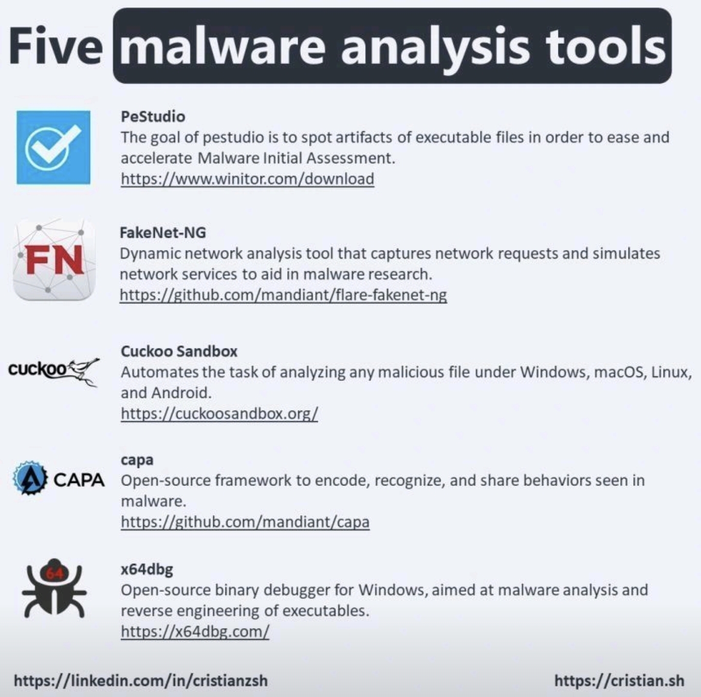

# 도구목록

현 단계에서 아는 것이 없기 때문에 일단 목록화

## OS
- Kali Linux: 다양한 도구가 있습니다.

## Tools
- nuclei: 취약점 도구
- nmap: 취약점/스캐닝 도구
- nikto: 취약점 도구
- Metasploit: 취약점 도구
- 기타 등등

## SIEM (적어도 데모가 가능한 것들)
SOC Analyst(보안관제)의 친구인 SIEM입니다. 현재 NDR/EDR 회사와 더불어 XDR로 향해 달려가고 있습니다.

- Splunk: 유료(60일 무료)
- Qradar: 유료(파악 필요)
- Arksight: 유료(확인 필요)
- Elastic: 부분 유료
- Wazuh: Open Source

## Hypervisor(LAB)
환경 구축을 위한 도구 목록입니다.

- VMWare Workstation (Type-2)
- VMWare ESXi (Type-1)
- Openstack
- Proxmox

## Network Forensic
- Wireshark
    - Tshark: CLI(커맨드 환경)

## Encorder/Decorder
- Cyberchef

## 정규식 변환
- Regex101

## 평판/분석 사이트
- Virustotal (Google)
- Hybrid Analysis (CrowdStrike)
- tria.ge (Recorded Future)

## Malware 및 악성 트래픽 획득
- Virustotal (Google)
- Hybrid Analysis (CrowdStrike)
- tria.ge (Recorded Future)
- malware-traffic-analysis: https://www.malware-traffic-analysis.net/

