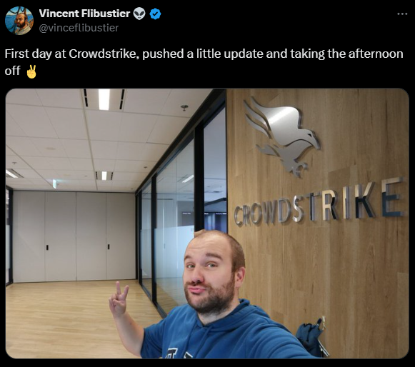
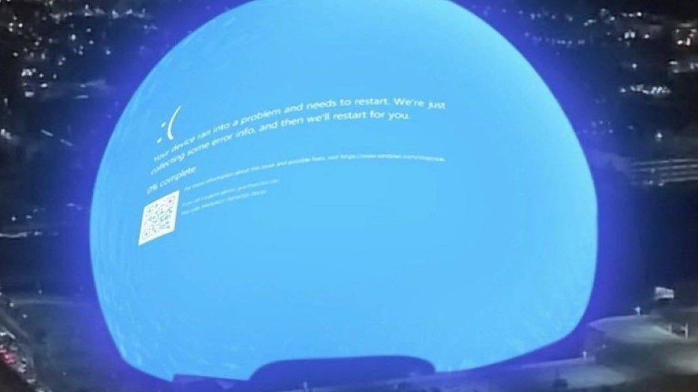
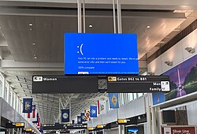
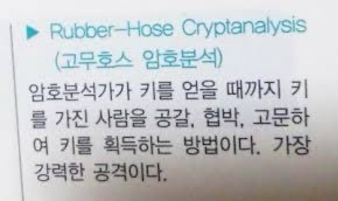

## 2024년 크라우드 스트라이크 사태

크라우드스트라이크가 정리한 내용에 따르면 2024년 7월 19일 금요일 크라우드스트라이크는 윈도 기반 컴퓨터들에 설치되는 팔콘(Falcon) 플랫폼의 정기 업데이트를 진행했다고 한다. ([보안뉴스](https://www.boannews.com/media/view.asp?idx=131613), 크라우드스트라이크, IT 마비 사태 이후 첫 번째 보고서 발표 中)

### 작은 업데이트
- 입사하고 작은 업데이트를 진행했다는 이야기다. ([Link](https://x.com/vinceflibustier/status/1814233715641389456))
- 물론 페이크라는 것을 알 수 있다 ([NDTV](https://www.ndtv.com/world-news/microsoft-outage-crowdstrike-vincent-flibustier-the-fake-crowdstrike-worker-who-crippled-windows-users-worldwide-6145878))

### 영향도
아래 사진은 실제 CrowdStrike의 문제로써 발생했는지는 알 수 없지만 해당 사진의 장소는 라스베가스 '스피어'라는 돔이라고 한다 ([link](https://turingpost.co.kr/p/crowdstrike-incident-wakeupcall-for-insurance-of-digital-and-ai-risk))

[위키백과](https://ko.wikipedia.org/wiki/2024%EB%85%84_%ED%81%AC%EB%9D%BC%EC%9A%B0%EB%93%9C%EC%8A%A4%ED%8A%B8%EB%9D%BC%EC%9D%B4%ED%81%AC_%EC%82%AC%EA%B3%A0)에서 주로 공항위주의 사례를 소개했는데 블루스크린의 영향은 매우 큰 것을 알 수 있다.

## 고무호스 암호분석
고무호스 암호분석의 시나리오를 알고 싶다면 Wikipedia의 [Deniable encryption
](https://en.wikipedia.org/wiki/Deniable_encryption) 문서를 참고하십시오.

